# LeakLens AI

**Turn authorized documents and repositories into redacted, reviewable data-exposure cases.**

LeakLens detects suspected secrets and selected personal data, connects findings to organization evidence, and helps an analyst investigate, record a decision, and recheck the source. It runs without a paid AI key; a bounded AI investigation is optional.

[Quick start](#quick-start) · [Product tour](#product-tour) · [Architecture](#architecture) · [Repository map](#repository-map) · [Verification](#verification) · [Documentation](#documentation)

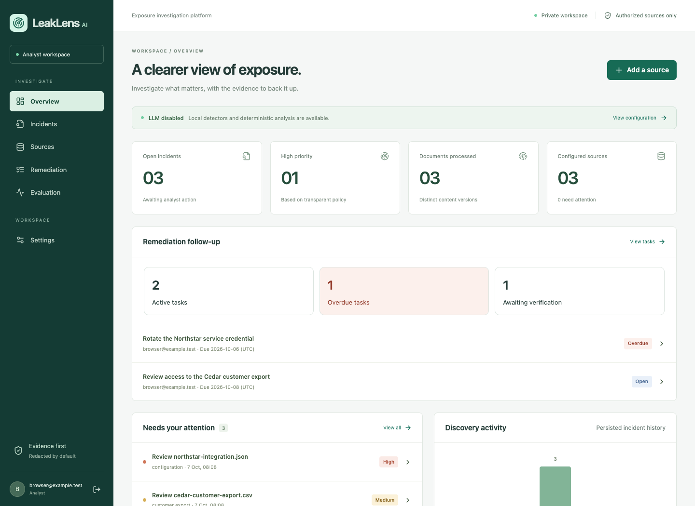

*The running application with synthetic data. The overview connects incident priority with overdue work and actions awaiting verification. All screenshots below use fictional organizations and nonfunctional fixture credentials.*

## The whole project in one picture

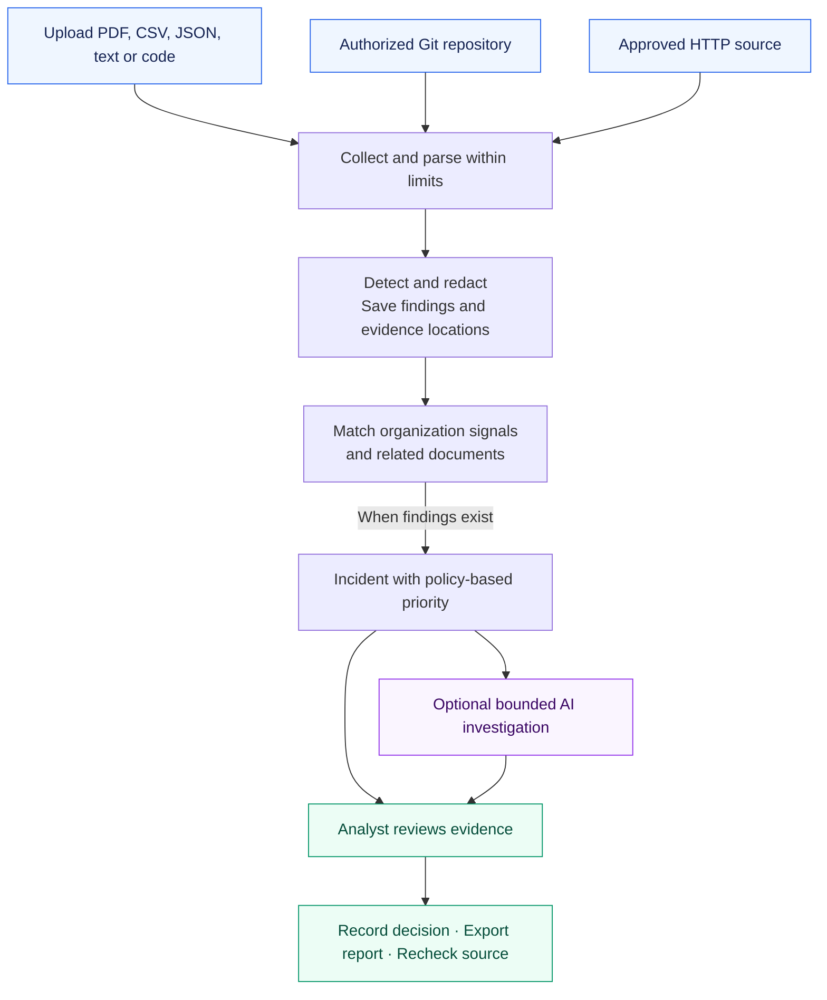

| Analyst action | What the app provides |
|---|---|
| Define an organization | Approved names, domains, aliases, reference IDs and asset importance |
| Add an authorized source | Uploads, local Git, HTTPS Git or constrained HTTP collection |
| Maintain sources | Search and pagination, edit collection settings, archive/restore, and audited configuration history |
| Scan | Background progress, cancellation, retry and explicit coverage warnings |
| Inspect an incident | Redacted excerpts, line locations, attribution signals and priority reasons |
| Investigate | Deterministic offline summary or optional live agent with observable tool calls |
| Decide and follow up | Audited review history, priority overrides, redacted JSON, browser printing and manual rechecks |
| Track remediation | Assign workspace members, set deadlines, record actions and verification, and find overdue work in a shared queue |

## Quick start

Choose **local development** for the simplest start, or **Docker Compose** for PostgreSQL and a durable job queue.

### Option A — local development

Prerequisites: Python **3.12**, [uv](https://docs.astral.sh/uv/), Node **22+**, npm and Git **2.50+**. Supported environments: Apple Silicon and Linux.

```sh
make setup       # install locked dependencies, create private config, migrate SQLite
make detectors   # install checksum-verified Gitleaks 8.30.1
make user        # choose your analyst email and password
make dev
```

Open **http://localhost:5173**. Setup preserves existing `.env` files. Local Git repositories must be under `.data/repos`, unless `LOCAL_REPO_ROOT` is configured otherwise.

### Option B — Docker Compose

Prerequisites: Python 3, plus a running Docker Desktop or Docker Engine with Compose v2.

```sh
python3 scripts/setup.py
make compose-up
make compose-user
```

Open **http://127.0.0.1:8080** using this exact IPv4 address. Only the frontend is published to the host, on loopback. Compose keeps its own persistent database, separate from local SQLite. Use `docker compose stop` to stop services while preserving volumes.

### Your first investigation

No default password or preloaded demo data is shipped. After creating your account:

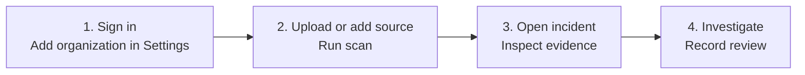

Use synthetic or explicitly authorized material. A scan with no findings produces no incident.

## Product tour

### Collect documents and keep source history

Upload PDF, CSV, JSON, text, and code files, or configure an authorized Git/HTTP source. **Sources** shows collection health, scan coverage, and the configuration revision used for each scan. Search sources, adjust collection limits, reanalyze available originals, or archive a source while retaining its evidence and history.

The example below shows three supplied files and completed scans. Uploads remain labeled **supplied**: their presence in the workspace does not establish public exposure.

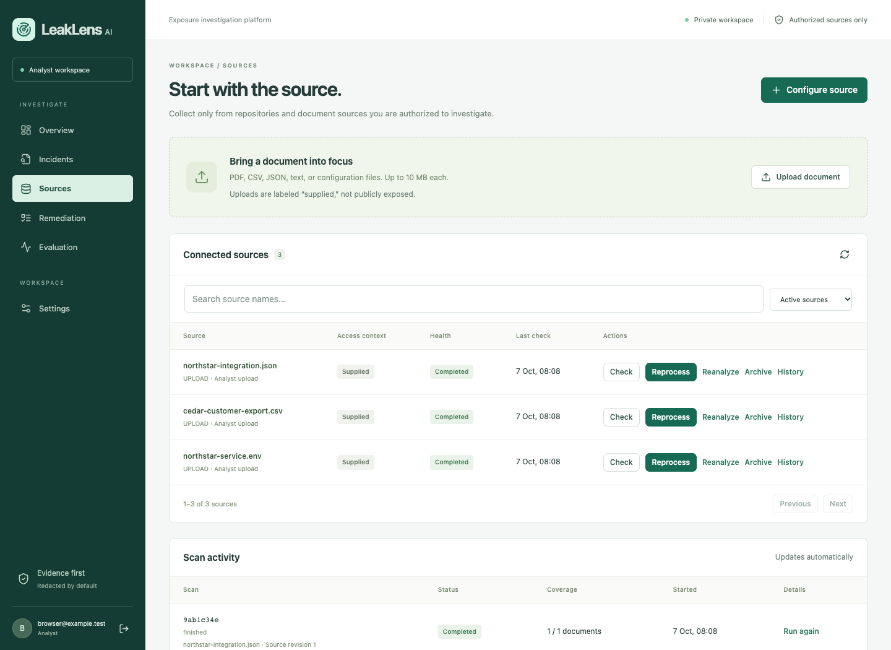

### Inspect the evidence behind an incident

Open a case to see its priority, review status, analysis revision, and redacted excerpts with line numbers and citation anchors. Organization attribution exposes the matching names, domains, and reference IDs. Record a reason when confirming, dismissing, reopening, or changing the priority of a finding; export a redacted JSON report or print the case for review.

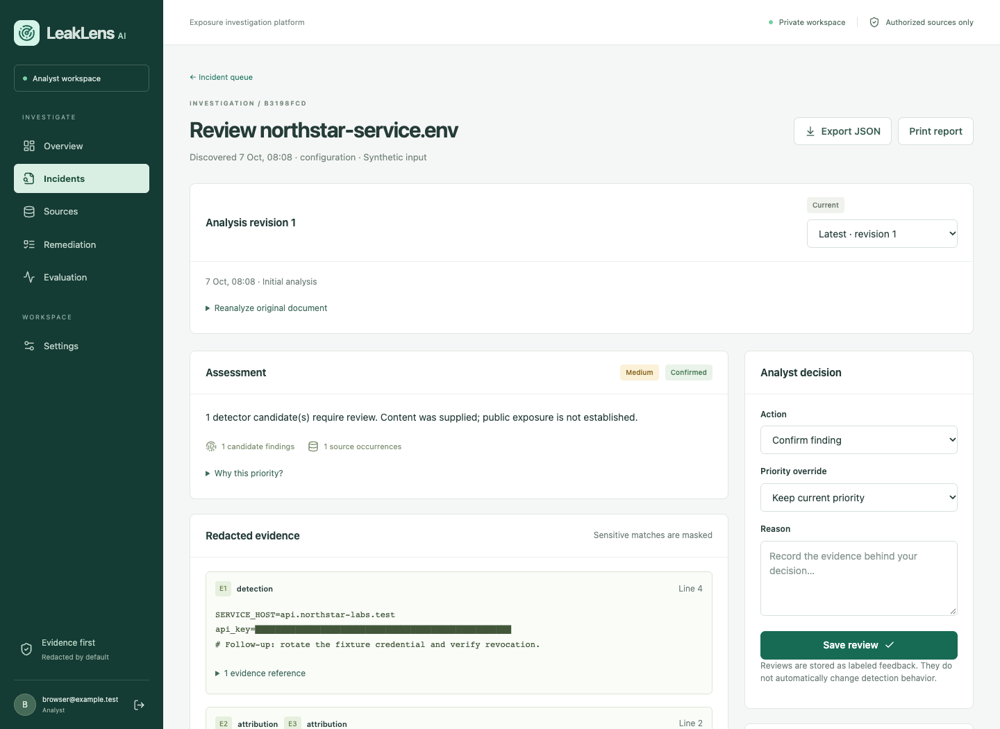

<details>
<summary><strong>Find the next case in the incident queue</strong></summary>

Filter by priority, status, organization, category, or discovery date. Search, filters, and pagination are kept in the URL so a bookmarked view survives refresh and returning from a case.

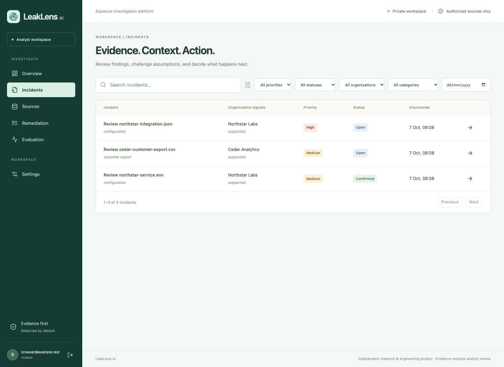

</details>

### Assign remediation and verify the action

Create follow-up tasks directly from an incident, assign a workspace member, set a UTC due date, and attach supporting evidence. **Remediation** brings those tasks into one queue with active, overdue, blocked, completed, and awaiting-verification views. Use **Me** or **Unassigned** to narrow ownership; the overview links directly to work that needs attention.

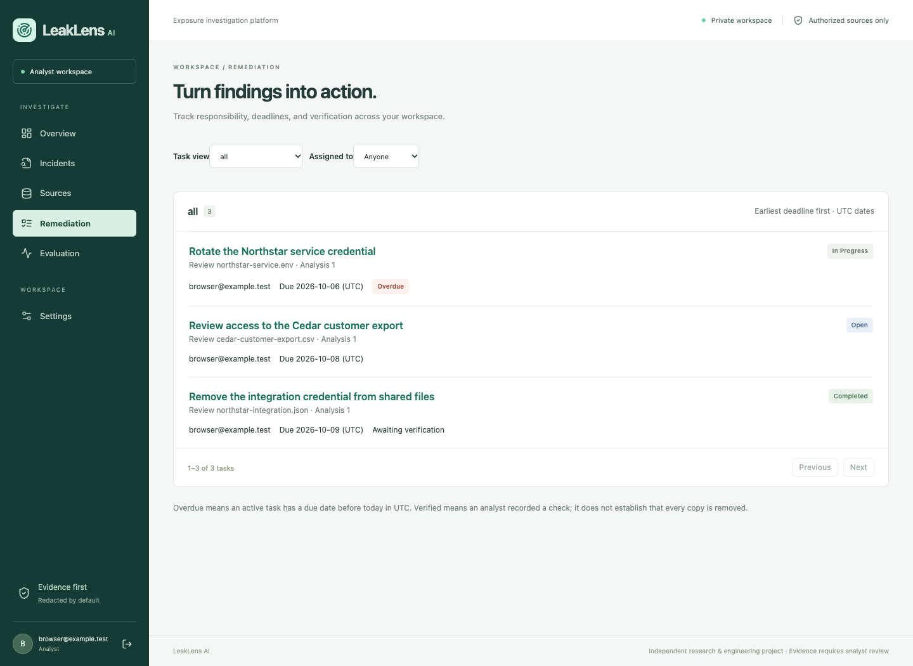

<details>
<summary><strong>See the difference between completion and verification</strong></summary>

Completion records the action taken. Verification separately captures the analyst's check, supporting notes, identity, and timestamp. Task history preserves each change and its reason. Neither step automatically closes the incident or proves that every copy has disappeared.

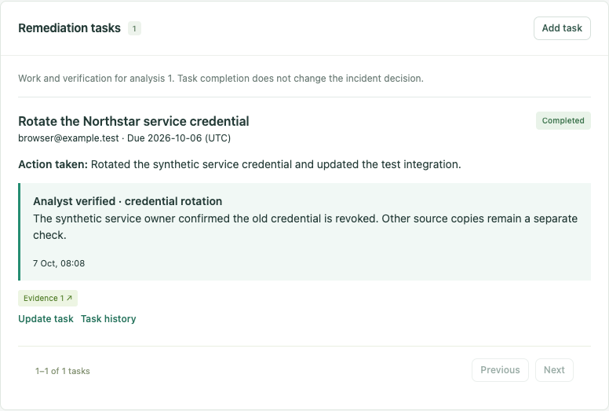

</details>

### Reanalyze and compare without losing earlier decisions

When organization profiles or analysis inputs change, create a fresh analysis from the original bytes. Earlier evidence, reviews, investigations, and tasks remain attached to their own revision. **Compare analyses** shows added, removed, and unchanged findings alongside changed inputs, attribution, policy priority, and redacted text.

In this example, marking the associated asset as critical changes the policy priority from **medium → high** while the original finding and redacted text remain unchanged. This comparison covers two analyses of the same content; comparison between different file versions is still planned.

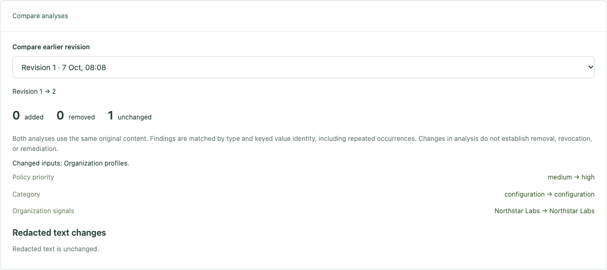

### Investigate with or without an AI provider

Scanning, detection, redaction, attribution, and priority calculation run locally without a paid AI key. Run an **offline assessment** for a deterministic summary, or configure the optional live agent for a bounded investigation using six case-scoped read-only tools. Live results include tool activity, evidence citations, and recorded usage. See [where the AI fits](#where-the-ai-fits) for its limits and configuration; the screenshots use offline mode.

Screenshots are generated from real API operations in a disposable workspace. To refresh them after UI changes, run `make screenshots`; see the [capture instructions](docs/images/README.md).

## Architecture

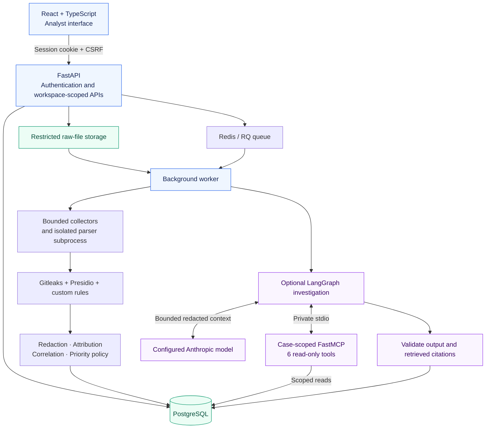

| Layer | Technology / responsibility |
|---|---|
| Interface | React 19, TypeScript, Vite; overview, sources, incidents, settings and evaluation |
| API and access | FastAPI, Pydantic, Argon2 passwords, opaque sessions and workspace checks |
| Persistence | SQLAlchemy + Alembic; PostgreSQL in Compose, SQLite locally |
| Background work | Redis/RQ in Compose; a single background executor locally |
| Extraction and detection | pypdf, bounded CSV/JSON/text parsing, Gitleaks, selected Presidio recognizers and custom rules |
| Optional AI | One LangGraph agent, Anthropic provider and FastMCP 3.4.7 over stdio |

Local development runs **one API process** with SQLite. Compose adds the durable queue, worker and hourly raw-file retention / stale-job recovery. The same application code and migrations serve both modes.

### Source management

The Sources screen supports search, active/archived filters, and paginated source and scan history. Edit a source to change its name, access context, and collection limits after reaffirming authorization. Its connector type and destination remain fixed; configure a new source for a different repository or root URL. Edits and archiving wait for any active scan to finish or be cancelled.

Archiving preserves incidents, reports, and history while blocking new checks/scans. Restore the source to resume manual scans. Each change records its actor and revision, and new scan jobs capture the configuration they execute. Editing access context does not rewrite previously observed evidence. Automatic schedules remain planned.

For an existing local installation, stop the app, run `make migrate`, and restart with `make dev`. Compose applies migrations through its migration service when updating. The source-management migration preserves existing records; old completed scans are labeled as having no recorded configuration.

## How evidence stays traceable

The app separates **content**, **analysis revisions**, **where it was observed**, and **what the analyst decided**.

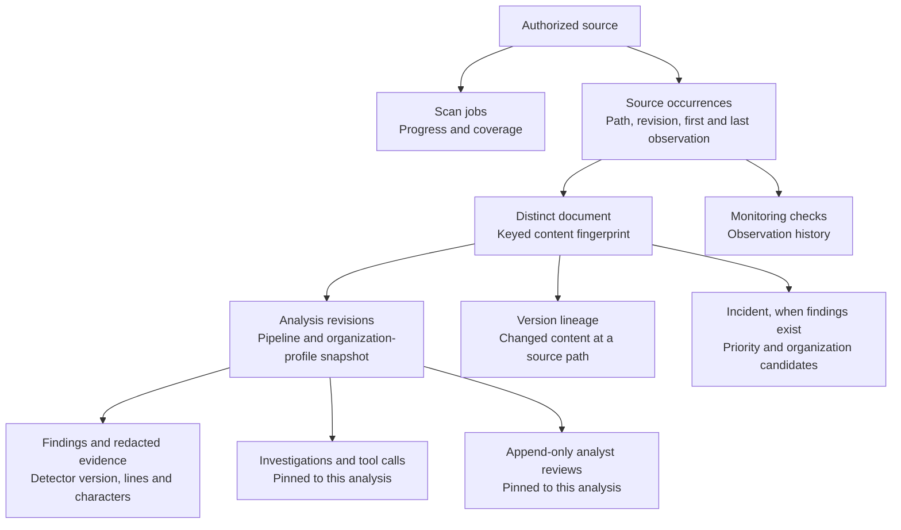

| Situation | How LeakLens represents it |
|---|---|
| Identical content appears again | Reuse a compatible analysis; changed pipeline, profiles, format, or exposure context creates a new revision |
| An analyst requests reanalysis | Read original bytes and create a new revision with a reason, preserving earlier findings and decisions |
| Content changes at the same source path | Preserve distinct content and version lineage |
| Documents look similar or repeat a secret | Add candidate links; keep separate incidents |
| A domain or reference matches an organization | Store attribution evidence; ambiguous candidates stay visible |
| An analyst changes priority or disposition | Append an audited review |
| A source cannot be reached | Record uncertainty; a failed request does not prove removal |

Content and secret identities use **HMAC-SHA256**. Similarity uses hashed shingles of redacted text. Priority comes from an explainable code policy; the model cannot overwrite it.

### Incident workflow

Incident search, filters, and pagination are stored in the URL. Bookmark a view or return from a detail page to the same queue. Search updates are debounced; invalid page offsets recover to an available page. Repeated excerpts share a display block while every evidence ID and citation anchor remains accessible. Finished AI assessments stop polling; slow requests finish before the next poll begins. A newly loaded analysis resets an unfinished review form so a draft decision is not silently carried to another revision.

### Remediation work

Open an incident and choose **Remediation tasks → Add task** to record follow-up work, an optional owner and due date, and supporting evidence. The **Remediation** screen offers active, overdue, blocked, completed, cancelled, and awaiting-verification views, with **Me** and **Unassigned** filters. Filters and pagination survive refresh. The overview links to active and overdue work and actions awaiting verification. Deadlines are calendar dates in **UTC**; a task becomes overdue on the following UTC day while it is open, in progress, or blocked.

Completing a task requires recording the action taken. Verification is a separate analyst assertion: select credential rotation/revocation, removal from the checked source, or another check, and record supporting notes. Every change captures its actor, reason, timestamp, and full task state; stale edits are rejected. Reopening or cancelling a task clears its current verification while preserving earlier events. Task completion and verification leave the incident's review status unchanged.

Tasks stay attached to the analysis that prompted them. Reanalysis does not carry completed work or verification into the new revision. Available historical tasks remain editable by selecting their analysis, and the queue flags when newer evidence exists. Restricted analyses hide task text and history snapshots and block task updates; create new work after reanalyzing the original bytes. Restricted task metadata still contributes to queue counts. Source observations, recorded actions, and credential revocation remain distinct evidence.

The owner picker currently lists the first 100 workspace members; invitations and role management remain planned. Incident JSON reports include the latest task state for the selected analysis, with a bounded first page of 100 tasks and explicit `total`, `offset`, and `limit`. Use `/api/remediation-tasks` for further pages and `/api/remediation-tasks/{id}/history` for the paginated audit trail. Existing local installations need `make migrate` before restarting the updated app.

### Reanalysis and history

Open an incident’s **Analysis revision** selector to inspect earlier evidence, reviews, and AI investigations. Choose **Reanalyze original document**, select an available authorized source, and record a reason. **Sources → Reanalyze** collects all available documents within that source’s limits, including documents with no previous findings. Compatible ordinary scans reuse results; changed analysis inputs automatically produce a fresh revision when original content is observed again.

Use **Compare analyses** to compare the selected revision with an earlier available revision. The report shows added/removed/unchanged findings, changed inputs, attribution and policy changes, and a redacted-text preview. It compares analyses of the **same original content**; comparison of different content versions at a source path remains planned. Restricted revisions cannot be compared. Preview limits are explicit: 100 added/removed entries, and 400 lines / 24,000 characters of text; counts include all findings. A changed result does not prove removal or remediation.

Each new analysis starts an open review with its calculated priority. Earlier confirmations, dismissals, remediation decisions, and priority overrides remain attached to their original revision. A result with no findings does not automatically establish remediation or complete detection coverage. Observation history always describes the latest source checks, independently of the selected analysis revision.

Expired uploads require uploading the original file again. A targeted remote reanalysis must find matching original bytes; changed or unavailable files leave the current analysis intact. Redacted text is never used as substitute input. After reuploading unchanged content with compatible analysis, select the newly available source to explicitly request another revision.

**Upgrading existing data:** migration `a821f47d62bc` preserves old records as revision 1 with unknown pipeline/profile provenance. It restricts their excerpts, derived assessments, and exports. A parser/detector change also restricts revisions produced by a different redaction pipeline. Reanalyzing original bytes creates a usable new revision; the old restricted revision remains preserved for operator audit and is not automatically unlocked. Organization/profile or priority-policy changes mark results stale without restricting compatible redaction. This does not certify that automated redaction catches every sensitive value.

JSON exports use schema version **2**, identify the selected analysis revision, and return HTTP 409 for restricted revisions. API clients can select history with `?analysis_revision=N` on incident detail/export and should send `analysis_revision` with review/investigation requests to reject stale screens. Reanalysis endpoints require a reason and an expected document/source revision. See the [security review](docs/SECURITY_REVIEW.md) and [rollback instructions](docs/DEPLOYMENT.md#updates-and-rollback).

## Where the AI fits

Collection, detection, redaction and priority calculation work without an LLM. AI is an optional investigation step after an incident exists.

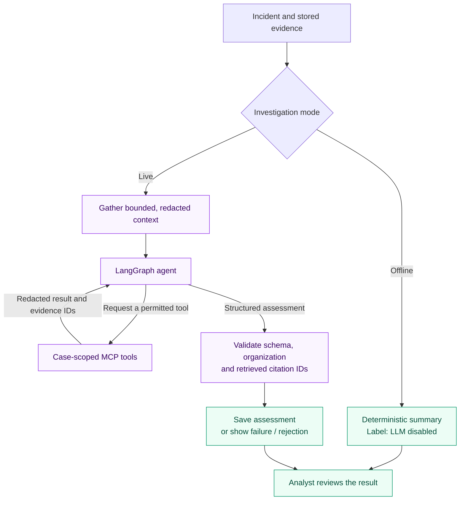

| Read-only MCP tool | Purpose |
|---|---|
| `get_document_metadata` | Inspect document metadata and coverage |
| `get_redacted_content` | Retrieve bounded excerpts and visible evidence IDs |
| `find_company_evidence` | Inspect stored organization-association signals |
| `find_related_documents` | Inspect persisted related-document candidates |
| `get_exposure_history` | Review source observations over time |
| `search_remediation_guidance` | Retrieve curated remediation guidance |

The tools have an immutable workspace/case scope and no generic shell, network or write capability. Default investigation ceilings are **6 tool calls**, **90 seconds**, **18,000 input tokens** and **3,000 output tokens**. Citation checks verify retrieved IDs; semantic support for the model's prose still requires review.

<details>
<summary><strong>Enable the optional live provider</strong></summary>

Set these values in the private **server environment**:

```dotenv
LLM_MODE=live
ANTHROPIC_API_KEY=<your-private-key>
LLM_MODEL=<your-chosen-model>
```

Restart the backend/worker, then select **Run live agent** on an incident. Keep provider keys out of frontend code and Git. Only bounded, redacted context is sent; redaction is not a guarantee that all sensitive content has been removed.

Configure both `INPUT_PRICE_PER_MILLION` and `OUTPUT_PRICE_PER_MILLION` to enable the conservative dollar ceiling. Token, time and tool limits apply independently. Pricing is not assumed; usage is recorded even if investigation fails.

**Live-provider validation remains pending.** Integration tests use a controlled provider adapter with real MCP stdio transport. Offline mode makes no model or MCP calls.

</details>

## Repository map

```text
Leak_Lens_AI/
├── backend/
│   ├── app/
│   │   ├── api/             # Application assembly, domain routers, schemas, middleware
│   │   ├── analysis.py      # Analysis provenance, freshness, and revision scope
│   │   ├── incidents.py     # Revision-aware reports and mutation guards
│   │   ├── comparison.py    # Bounded analysis comparisons
│   │   ├── remediation.py   # Task ownership, deadlines, verification and audit
│   │   ├── scans.py         # Scan submission and queue failure handling
│   │   ├── connectors/      # Authorized Git / HTTP collection and URL policy
│   │   ├── parsers/         # Format extraction and subprocess limits
│   │   ├── detectors/       # Secret / personal-data detection and redaction
│   │   ├── attribution/     # Organization evidence and candidate scoring
│   │   ├── correlation/     # Similar-content and repeated-secret links
│   │   ├── workers/         # Scan jobs, ingestion and retention
│   │   ├── agent/           # Bounded LangGraph investigation
│   │   ├── mcp/             # Six case-scoped read-only tools
│   │   ├── models/          # Database entities and relationships
│   │   └── evaluation.py    # Reproducible benchmark runner
│   ├── migrations/         # Alembic database migrations
│   └── tests/              # Backend, security, MCP and integration checks
├── frontend/
│   ├── src/
│   │   ├── App.tsx         # Authentication and application navigation
│   │   ├── pages/          # Individual analyst screens
│   │   ├── components/     # Shared UI, source dialogs, evidence and comparisons
│   │   ├── hooks/          # Request lifecycle, polling, and URL filters
│   │   └── lib/            # Display formatters
│   └── tests/              # Playwright analyst journey
├── evaluation/             # Synthetic inputs, ground truth and saved results
├── scripts/                # Setup, development, detector install and smoke checks
├── docs/                   # Architecture, deployment, evaluation and security
├── compose.yaml            # Local PostgreSQL + Redis deployment
├── compose.production.yaml # Deployment overrides
├── .env.example            # Configuration template; no real credentials
└── Makefile                # Common setup, run and verification commands
```

**Suggested reading path:** [scan pipeline](backend/app/workers/jobs.py) → [data model](backend/app/models/__init__.py) → [API routers](backend/app/api/routes) → [reports](backend/app/incidents.py) → [agent](backend/app/agent/runner.py) → [interface](frontend/src/App.tsx).

## Verification

| Command | What it checks |
|---|---|
| `make test` | Backend, security regressions, real MCP transport and controlled-provider integration |
| `make migrate` | Apply pending database migrations for local development |
| `make build` | TypeScript and production frontend build |
| `make e2e` | Chrome analyst journey against a fresh disposable database |
| `make screenshots` | Regenerate the README product tour using a disposable workspace and synthetic inputs |
| `make compose-test` | API + PostgreSQL + Redis worker smoke test in running Compose |
| `make evaluate` | Development benchmark; writes measured results |

**Recorded checks — 2026-10-07:** 106 backend tests passed, 1 opt-in live-provider test skipped, and 6 Chrome browser scenarios passed. TypeScript/build, Ruff (including import ordering), and whitespace checks passed. New coverage includes task ownership and evidence scope, completion/verification, stale edits, redaction, historical follow-up, UTC deadlines, migration preservation, readiness, and the complete desktop/mobile remediation workflow. CI and earlier audit/runtime records remain attributed to their actual runs in [PROGRESS.md](PROGRESS.md).

Browser tests require installed Google Chrome and write verification screenshots to ignored `frontend/test-results/`. They use a disposable database, not the owner's workspace.

### What the benchmark measures

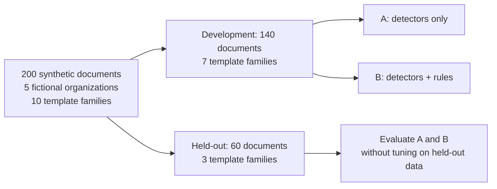

Copies and all organization variants of a template family stay in the same split. Ground truth is separate from runtime inputs.

| Saved result | Development | Held-out |
|---|---:|---:|
| Detection F1 — A: detectors only | 0.909 | 1.000 |
| Detection F1 — B: detectors + rules | 1.000 | 1.000 |
| Duplicate-grouping F1 | 0.407 | 0.298 |

These are **historical synthetic results for detector version 1.0**, not real-world accuracy claims or measurements of the current 1.1 detectors. Duplicate grouping remains weak. The live-agent benchmark has not run. See the [methodology](docs/EVALUATION.md), [development report](evaluation/report-development.md) and [held-out report](evaluation/report-held_out.md).

<details>
<summary><strong>Publish evaluation results and maintain local data</strong></summary>

Publish a measured development result to your workspace's Evaluation screen:

```sh
cd backend
PATH="../.data/bin:$PATH" .venv/bin/python -m app.evaluation --split development --publish-email YOUR_ANALYST_EMAIL
```

From the repository root:

```sh
make purge       # remove expired raw files; default retention is 24 hours
make recover     # mark stale interrupted jobs failed so they can be retried
```

Compose runs these maintenance tasks hourly. Local development requires manual execution or scheduling. Redacted evidence is retained separately from raw files.

</details>

## Scope and boundaries

| Supported today | Boundary |
|---|---|
| Authenticated owner workspace | No unrestricted public upload service or enterprise discovery claim |
| Authorized uploads, Git and HTTP sources | No arbitrary web search, SSH Git or private Git authentication |
| Bounded PDF, CSV, JSON, text and code extraction | No OCR or archive extraction; partial coverage is reported |
| Pattern-based redaction and selected personal-data entities | Coverage is intentionally narrow and redaction can miss values |
| Source observations and manual rechecks | An upload does not establish public exposure; disappearance does not prove deletion or credential revocation |
| Audited analyst decisions | No automatic credential testing or model-controlled priority changes |

Public hosting/HTTPS, real-provider validation, an authorized external Git smoke test, unfamiliar-organization evaluation, independent semantic-claim review and broader mixed-format benchmarks remain pending. Review the [threat model](docs/THREAT_MODEL.md) before using real sensitive data.

## Documentation

| Read this | To understand |
|---|---|
| [Architecture](docs/ARCHITECTURE.md) | Process boundaries, persistence and design tradeoffs |
| [Engineering notes](docs/ENGINEERING.md) | Implementation choices and development details |
| [Deployment](docs/DEPLOYMENT.md) | Configuration, operation and deployment constraints |
| [Evaluation](docs/EVALUATION.md) | Dataset construction, splits and metric definitions |
| [Threat model](docs/THREAT_MODEL.md) | Trust boundaries, safeguards and residual risks |
| [Security review](docs/SECURITY_REVIEW.md) | Fixed findings, dependency changes and historical-data caveats |
| [Progress](PROGRESS.md) / [TODO](TODO.md) | Completed checks and remaining work |

Independent LeakLens branding; no affiliation with CybelAngel. This is a portfolio-scale engineering project. Presentation assets and a seeded demonstration are deferred.
