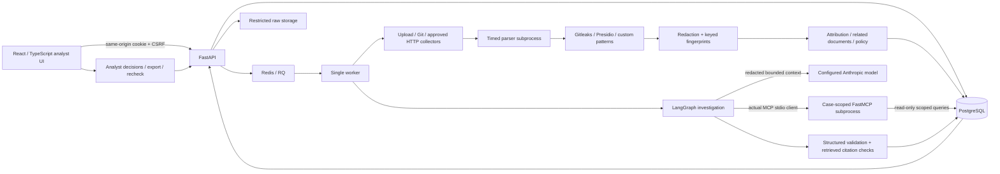

# Architecture

## Code organization

`backend/app/api/main.py` assembles the app and installs shared errors/middleware. Domain routers in `api/routes/` own authentication, workspace settings, sources, scans, incidents, and health endpoints. Existing endpoint URLs are unchanged. `scans.py` submits work, `incidents.py` builds revision-aware reports and enforces mutation guards, `analysis.py` tracks compatibility/scope, and `comparison.py` computes bounded read-only comparisons. Workers use a single shared enqueue boundary, which tests replace with synchronous execution. Ruff enforces unused-import and import-order checks.

The frontend entry point mounts `App.tsx`; screens live in `pages/`, dialogs/report components in `components/`, asynchronous data and URL state in `hooks/`, and display formatters in `lib/`. Source and incident pagination share a component. Polling schedules the next request after completion, supports terminal-state predicates, and aborts obsolete requests on navigation. Parent incident reports continue applying analysis restrictions even when a finished investigation has stopped polling.

## Processes and boundaries

The API authenticates analysts, validates source configuration, writes uploads under generated IDs, and queues work. It does not run repository code. One worker performs collection, then delegates parsing to short-lived subprocesses with CPU/time limits and Linux address-space limits. Gitleaks executes as a bounded local detector process. Presidio recognizers run in the worker, using local public suffix data; no language model download or public suffix network refresh occurs.

The worker writes redacted excerpts, findings, attribution evidence, versions, and source observations transactionally per document. Partial scans preserve successfully committed documents. Exact content identities and secret identities use keyed HMAC-SHA256. Comparison shingles are computed from redacted text. The last 500 distinct documents are considered for near-duplicate candidates; repeated secret matches use indexed keyed fingerprints.

Live investigation uses `gather_context → agent_investigation → MCP tools → agent_investigation → validate_result`. Collection, detection, and policy calculation are explicit worker phases preceding that graph. Validation attaches the existing code-computed policy and never lets model output overwrite the incident's priority. Human review and priority overrides are separate authenticated API actions with audit records. Empty graph nodes that previously represented those external stages have been removed.

FastMCP 3.4.7's compatible client is an actual MCP client adapter. It launches the internal server with immutable workspace/case IDs and analysis revisions supplied by the trusted worker, without loading the owner's dotenv file or provider key. Model arguments cannot change that scope. Related documents and returned relationship metadata must be in the investigation’s captured allowed set. Each content, metadata, and attribution tool resolves its pinned analysis revision and checks redaction compatibility; later reanalysis cannot substitute newer evidence into a running investigation. No externally reachable MCP listener or generic shell/network/write tool exists. The six tools return timestamp, completeness, error information, and applicable evidence IDs. Metadata-only and curated-guidance responses have no document evidence IDs. Content responses expose citation IDs only for evidence fully contained in the returned text window.

Model results must match a strict Pydantic schema. Organization proposals must be supported stored candidates. Citations must belong to this case and have actually been retrieved in successful tool results. IDs alone do not validate the semantics of prose: claim support stays `unreviewed`. Failed, timed-out, unsupported, and malformed assessments are visibly rejected. Failed tool calls are stored and returned to the model with errors; an investigation cannot complete without a successful MCP call.

## Persistence

| Entity | Purpose |
|---|---|
| Workspaces, users, sessions | Access scope and hashed opaque sessions |
| Organizations | Approved names, domains, aliases, reference IDs, asset importance |
| Sources, source events | Authorized connector configuration, revision, archive state, and actor-attributed change history |
| Scan jobs | Captured source configuration, progress, errors, coverage warnings, cancellation, attempt timing |
| Documents | Distinct keyed content identity and current analysis revision/cache |
| Document analyses | Immutable per-document revision, original input format, pipeline/profile snapshots, redacted results, reason, actor, and scan provenance |
| Document versions | Source-path/revision lineage between different contents |
| Source occurrences | A document at a source/path/revision with first/last observation |
| Findings, evidence | Analysis revision, detector identity/version/type, and exact normalized-text locations |
| Incidents | Review unit, independent priority policy, attribution signals, candidate links |
| Investigations, tool calls | Root/related analysis scope snapshot, prompt/model versions, validated output, observable tool activity, usage |
| Reviews | Append-only decisions bound to an analysis revision; no automatic feedback training |
| Monitoring checks | Timestamped observations, including uncertainty and disappearance |
| Evaluation runs | Actual recorded results scoped to the publishing analyst's workspace |

All public entity lookups enforce workspace scope. Missing and unauthorized IDs both return 404. The initial migration contains explicit table definitions and can be applied from an empty database. SQLite is a documented single-process development substitution; PostgreSQL is the deployment default.

## Tradeoffs

- RQ provides one durable queue without extra orchestration infrastructure. Local mode uses one executor for an accessible no-Docker start; interrupted local jobs require recovery.
- Presidio's recognizers are invoked directly for the declared entity subset. This avoids a large NLP model whose additional entities have not been evaluated.
- A conservative heuristic score supports attribution: domain/reference evidence weighs more than a name. Multiple strong candidates remain multiple candidates. Scores are not probabilities.
- One incident per distinct content object aggregates repeated occurrences. Candidate links preserve separate incidents and versions, so false grouping does not silently merge ownership or reviewer decisions.
- No embeddings were added without evidence that they improve attribution or duplicate grouping.
- No automatically public demo or default credentials were added. Owner-created workspaces and explicit source authorization are required.
- Source configuration changes have revision checks and an audit history. Connector type/destination stay fixed; a new destination requires a new source. Edits/archive wait for active scans; new jobs execute a captured configuration. Archiving preserves evidence and blocks checks/scans until restoration. Automatic scheduling remains future work.
- Analysis input manifests record parser/custom-rule versions, installed detector versions, extraction limits, attribution/policy versions, input format, effective exposure context, and a hash of the captured organization profiles. Rules must bump their declared version when behavior changes. Ordinary scans reuse compatible results; explicit requests create a revision even when inputs are unchanged. Successful zero-finding analyses are retained.
- Source revisioning, analysis revisioning, and content-version lineage are separate. A no-op document-row write serializes evidence/review changes on supported databases. A document receives at most one new analysis per scan job, even when duplicate files are collected. Failed per-document transactions roll back evidence, the current pointer, and incident state together. Operational support remains one API/worker; this is not a multi-replica scheduler.
- The current incident cache is reset to open/policy priority on a new analysis. Historical disposition is reconstructed only from that revision’s reviews. Observations remain latest-state data and are labeled accordingly in reports. A negative analysis does not close a previously existing incident.
- Legacy analyses with unknown provenance and revisions from an incompatible redaction pipeline are restricted at detail/list/export, investigation-result, worker, and MCP boundaries. Stored snapshots remain intact. New original-byte analysis creates a fresh available revision; historical excerpts are not silently rewritten. No application endpoint can unlock legacy evidence. Rollback refuses to flatten stores containing multiple revisions; restore the pre-upgrade backup with matching code.

## Analysis comparisons and current relationships

`GET /api/incidents/{id}/comparison?from_revision=N&to_revision=M` requires N < M and two available analyses of the same document. Findings match by type and internal keyed value identity, retaining repeated-occurrence counts; fingerprints never leave the backend. Added/removed entries link to evidence in the corresponding revision. Input/output text limits bound diff computation and rendering, and incomplete previews are labeled. Both revisions pass workspace and redaction restrictions before findings, text, or attribution are returned. This is an analysis comparison, not a comparison between different original files.

Reanalysis retires stale reciprocal links in the current incident cache before installing its new candidate relationships. Immutable analysis snapshots retain their prior claims. Queue/dashboard restriction checks use a single scoped document/analysis join instead of per-row lookups. Readiness probes analysis tables/columns as well as authentication storage and the configured queue; a reachable database missing the analysis migration returns 503.
