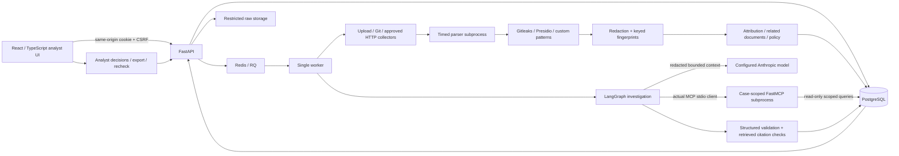

# Architecture

## Processes and boundaries

The API authenticates analysts, validates source configuration, writes uploads under generated IDs, and queues work. It does not run repository code. One worker performs collection, then delegates parsing to short-lived subprocesses with CPU/time limits and Linux address-space limits. Gitleaks executes as a bounded local detector process. Presidio recognizers run in the worker, using local public suffix data; no language model download or public suffix network refresh occurs.

The worker writes redacted excerpts, findings, attribution evidence, versions, and source observations transactionally per document. Partial scans preserve successfully committed documents. Exact content identities and secret identities use keyed HMAC-SHA256. Comparison shingles are computed from redacted text. The last 500 distinct documents are considered for near-duplicate candidates; repeated secret matches use indexed keyed fingerprints.

Live investigation uses `gather_context → agent_investigation → MCP tools → agent_investigation → validate_result`. Collection, detection, and policy calculation are explicit worker phases preceding that graph. Validation attaches the existing code-computed policy and never lets model output overwrite the incident's priority. Human review and priority overrides are separate authenticated API actions with audit records. Empty graph nodes that previously represented those external stages have been removed.

FastMCP 3.4.7's compatible client is an actual MCP client adapter. It launches the internal server with immutable workspace/case IDs supplied by the trusted worker, without loading the owner's dotenv file or provider key. Model arguments cannot change that scope. Related documents and returned relationship metadata must be in the persisted case's allowed set. No externally reachable MCP listener or generic shell/network/write tool exists. The six tools return timestamp, completeness, error information, and applicable evidence IDs. Metadata-only and curated-guidance responses have no document evidence IDs. Content responses expose citation IDs only for evidence fully contained in the returned text window.

Model results must match a strict Pydantic schema. Organization proposals must be supported stored candidates. Citations must belong to this case and have actually been retrieved in successful tool results. IDs alone do not validate the semantics of prose: claim support stays `unreviewed`. Failed, timed-out, unsupported, and malformed assessments are visibly rejected. Failed tool calls are stored and returned to the model with errors; an investigation cannot complete without a successful MCP call.

## Persistence

| Entity | Purpose |
|---|---|
| Workspaces, users, sessions | Access scope and hashed opaque sessions |
| Organizations | Approved names, domains, aliases, reference IDs, asset importance |
| Sources, source events | Authorized connector configuration, revision, archive state, and actor-attributed change history |
| Scan jobs | Captured source configuration, progress, errors, coverage warnings, cancellation, attempt timing |
| Documents | Distinct keyed content identity, redacted text, bounded parser metadata |
| Document versions | Source-path/revision lineage between different contents |
| Source occurrences | A document at a source/path/revision with first/last observation |
| Findings, evidence | Detector identity/version/type and exact normalized-text locations |
| Incidents | Review unit, independent priority policy, attribution signals, candidate links |
| Investigations, tool calls | Prompt/model versions, validated output, observable tool activity, usage |
| Reviews | Append-only analyst decision history; no automatic feedback training |
| Monitoring checks | Timestamped observations, including uncertainty and disappearance |
| Evaluation runs | Actual recorded results scoped to the publishing analyst's workspace |

All public entity lookups enforce workspace scope. Missing and unauthorized IDs both return 404. The initial migration contains explicit table definitions and can be applied from an empty database. SQLite is a documented single-process development substitution; PostgreSQL is the deployment default.

## Tradeoffs

- RQ provides one durable queue without extra orchestration infrastructure. Local mode uses one executor for an accessible no-Docker start; interrupted local jobs require recovery.
- Presidio's recognizers are invoked directly for the declared entity subset. This avoids a large NLP model whose additional entities have not been evaluated.
- A conservative heuristic score supports attribution: domain/reference evidence weighs more than a name. Multiple strong candidates remain multiple candidates. Scores are not probabilities.
- One incident per distinct content object aggregates repeated occurrences. Candidate links preserve separate incidents and versions, so false grouping does not silently merge ownership or reviewer decisions.
- No embeddings were added without evidence that they improve attribution or duplicate grouping.
- No automatically public demo or default credentials were added. Owner-created workspaces and explicit source authorization are required.
- Source configuration changes have revision checks and an audit history. Connector type/destination stay fixed; a new destination requires a new source. Edits/archive wait for active scans; new jobs execute a captured configuration. Archiving preserves evidence and blocks checks/scans until restoration. Automatic scheduling remains future work.
- Organization changes affect new distinct content, preserving old evidence rather than silently rewriting historic assessments. Source revisioning is separate from the future versioned document-analysis model.
